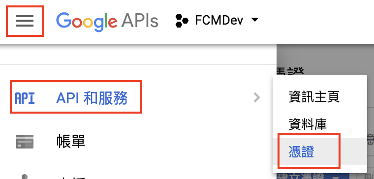
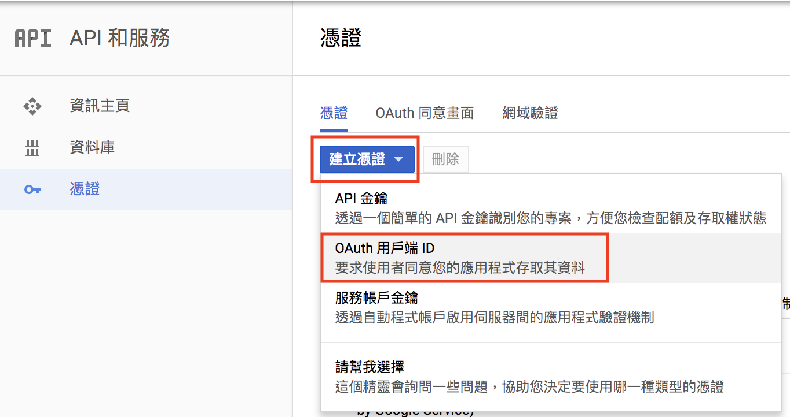
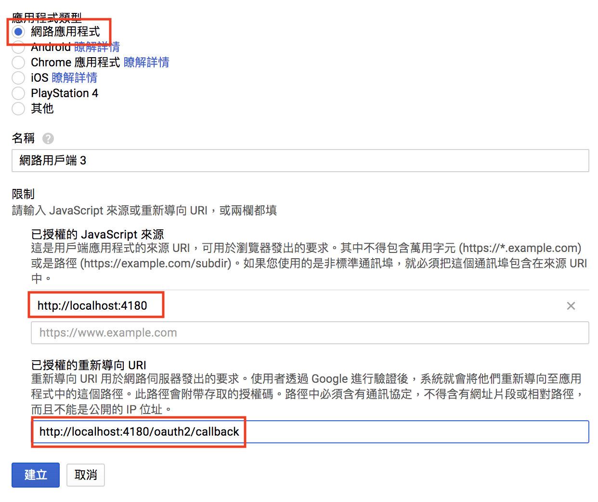
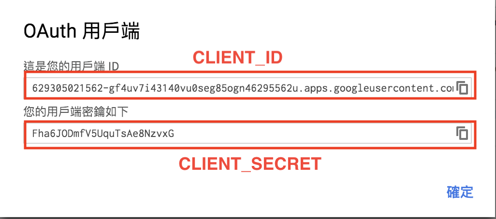

Kibana OAuth2
============

Use [oaut2_proxy](https://github.com/bitly/oauth2_proxy) and [X-pack](https://www.elastic.co/products/x-pack) for Kibana authentication. Use `google` as oauth2 provider.

NOTE:
1. Any authenticated `Google` account will be granted access to Kibana dashboard.
2. Authentication to Kibana is achieved with hard-coded elasticsearch account (elastic/changeme), configured in `xpack/docker-compose.yml`.
3. The configuration is modified using [kibana-oauth2-proxy](https://github.com/bertrandmartel/kibana-oauth2-proxy)

## Prerequisites

1. `Docker` & `Docker Compose` installed
2. [Google oauth2 client](https://console.developers.google.com/apis/credentials) configured

## Directories

`/oauth2_proxy`: Dockerfile and start script (configuring oauth2 proxy)
`/nginx_proxy`: Dockerfile and config file for Nginx. Proxy authenticated request (and add basic auth header) to Kibana.
`/xpack`: Docker compose yaml file.

## OAuth2 Configuration

1. Goes to [google console](https://console.developers.google.com/apis/credentials)



2. Create a new oauth2 client ID



3. Configure valid source & redirect uri



4. Copy client ID & secret and configure the environment variables in `/xpack/docker-compose.yml`.



**/xpack/docker-compose.yml**
```
# oauth2 credentials
- CLIENT_ID=<OAUTH_CLIENT_ID>
- CLIENT_SECRET=<OAUTH_CLIENT_SECRET>
```

## Run

```
cd xpack
docker-compose up -d
```

## Cleanup

```
cd xpack
docker-compose down
docker volume rm `docker volume ls -q -f dangling=true`
```

## Test

1. open `http://localhost:4180`, will be redirected to login page (not authenticated yet)
2. login with any google account
3. after logged in succefully, you will be redirected to kibana dashboard (and authenticated with the hard-coded account)
